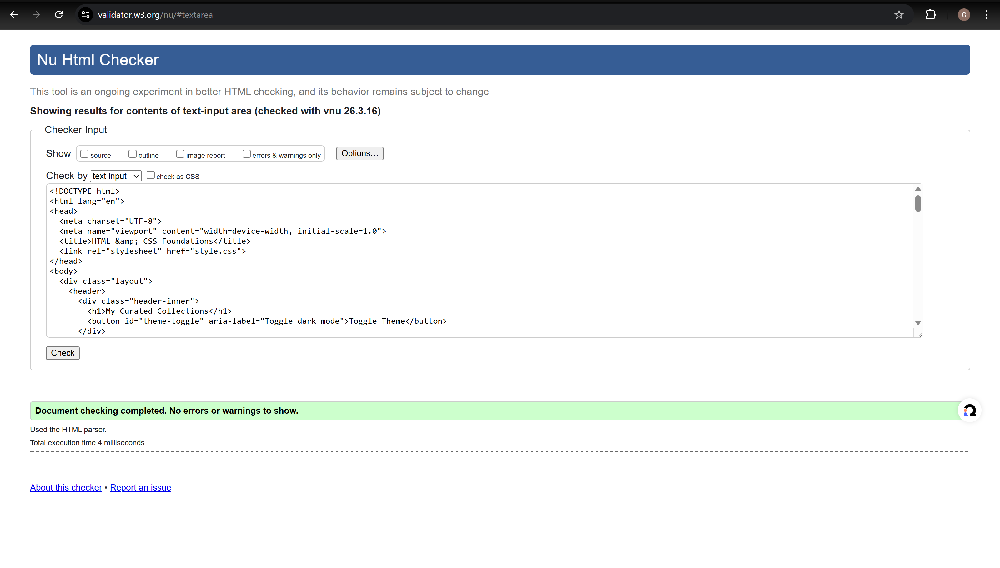

# HTML & CSS Foundations — Notes

## Drill 1: Semantic Structure
Used all the landmark elements — `<header>`, `<nav>`, `<main>`, `<aside>`, `<footer>`. The `<article>` wraps the main body inside `<main>`. Added an ordered list for top arcs, unordered for manga volumes, and a `<table>` with `<thead>`/`<tbody>` and `scope="col"` headers.

Hero image is a local `luffy-hero.png` in `assets/` with a descriptive `alt`. Ran it through the W3C validator — came back clean, no errors or warnings.

## Drill 2: CSS Variables & Theme
All design tokens (colors, fonts, spacing) live as custom properties on `:root`. Dark theme flips them under `:root[data-theme="dark"]`. The toggle button uses a tiny JS snippet to swap the `data-theme` attribute and saves the preference to localStorage.

## Drill 3: Responsive Units
`main` is constrained with `width: 100%` and `max-width: 900px` so it doesn't stretch on wide screens. Headlines and body text use `clamp()` for fluid sizing — no breakpoints needed for type. The hero section uses `min-height: 50vh` and flexbox to vertically center its content.

## Drill 4: Grid Primer
The page wrapper uses CSS Grid with named template areas — three columns on desktop, single column below 720px. Sidebar columns are `minmax(220px, 280px)` so they don't get too narrow or too wide. `main` has `overflow-y: auto` to keep long content from pushing the footer off-screen.

---

# Typography — Notes

## Drill 1: System vs Web Fonts
Three font stacks:
- Body: Inter → system-ui → the usual sans-serif fallbacks
- Headings: Geist (local) → Merriweather (Google) → Georgia
- Code: Source Code Pro → ui-monospace → Menlo → Consolas

Showed 400, 600, and 800 weights inline so the difference is visible.

## Drill 2: Google Fonts & Variable Axes
Imported Inter, Merriweather, and Source Code Pro from Google Fonts with `display=swap` and `preconnect` to keep layout shifts minimal. Added a range slider that dynamically changes `font-weight` on a demo paragraph — lets you see the weight change in real time.

## Drill 3: Local Font with @font-face
Downloaded Geist Regular (400) and Bold (700) as woff2 from the Vercel GitHub repo. Two `@font-face` blocks point to `assets/fonts/`. Headings pick up Geist first; if it ever fails to load, Merriweather and Georgia catch it.

## Drill 4: Hierarchy & Rhythm
Type scale goes from h1 (clamp-based, largest) down to h6 (fixed 1rem). Headings get tighter `line-height: 1.2` and slight negative letter-spacing. Body text is looser at `line-height: 1.7`.

Drop cap on the first article paragraph using `::first-letter` — floated left, oversized, colored with the accent. Hero title gets a subtle `text-shadow` but only on desktop (behind a `min-width: 721px` media query).

## Drill 5: Code Blocks & Emphasis
`pre` blocks use `--color-surface` as background with padding and `overflow-x: auto` for long lines. Inline `code` gets a lighter version of the same treatment. Blockquote has a 4px left border in the accent color, italic text, and a styled `<cite>`.

---

# Colors (HSL & OKLCH) — Notes

## Drill 1: Schemes with HSL
Replaced all hex colors with HSL. Built monochrome variants by sliding lightness (92% / 50% / 35%), a complementary at hue +180° (gold), and triads at +120° and +240° (red, green). They're all shown as colored cards so you can compare them side by side.

## Drill 2: Dark/Light Theme
All color tokens flip under `:root[data-theme="dark"]`. The JS toggle persists the choice in localStorage. Checked that the hero overlay, cards, code blocks, and swatches all stay readable in both modes.

## Drill 3: OKLCH for Contrast
Switched `--color-accent` and `--color-text` to `oklch()` values directly — not just as separate demo variables. Light theme uses `oklch(0.52 0.15 260)` for accent, dark uses `oklch(0.72 0.12 260)`. The lightness channel stays perceptually consistent across themes while chroma adjusts for vibrancy.

Checked body text contrast with DevTools — passes WCAG AA.

## Drill 4: Gradients & Depth
The hero has a `linear-gradient` overlay (dark at the bottom, transparent at top) so the white text stays readable over any photo. CTA button uses a `radial-gradient` lit from the top-left for a subtle 3D feel. Shadows are soft — high blur, low spread — and I kept them to just a couple of layers.

## Drill 5: HSL / OKLCH Swatches
Built a 7-swatch grid varying lightness (95% down to 35%) and saturation (45%, 65%, 85%) around the accent hue. Each swatch shows both its HSL and OKLCH values so you can compare the two spaces.

---

# Icons & Images — Notes

## Drill 1: Icon Implementation
Used three Material Symbols via the Google web font (favorite, star, bookmark) plus three more (share, download, and one inline SVG bell from Heroicons). The 6-icon grid has consistent 28px sizing, and they all get a color shift and `scale(1.08)` on hover.

**Takeaways:**
- Icon fonts are convenient when you use lots of icons — one `<link>` and you're done. But you load the whole font file (~100kb) even if you only need three.
- Inline SVG gives you full CSS control over fill/stroke and no extra request, but it makes the HTML verbose.
- For a small set like this, SVG wins. For a big app with 50+ icons, a font or sprite sheet makes more sense.

## Drill 2: Image Formats & Optimization
Three formats in the gallery: a JPG photo (ocean landscape from Unsplash), a transparent PNG (straw hat emblem with alpha channel, local file), and an inline SVG (Jolly Roger logo). All styled with `max-width: 100%`, `height: auto`, and a 6px border-radius.

**Image compression:** Downloaded the Unsplash ocean photo at q=90 (489 KB) and re-exported at q=60 (356 KB) — 27% smaller with no visible quality loss at display size. Both saved in `assets/images/` for reference.

## Drill 3: Responsive Images & Picture
Used `<picture>` with a WebP `<source>` and JPG `` fallback. Both have `srcset` at 600w and 1200w with matching `sizes`. The URLs use Unsplash's CDN with `fm=webp` and `fm=jpg` query params — so the browser genuinely picks the right format based on support.

Added `loading="lazy"` and `decoding="async"` on all images. You can verify which source loads in DevTools Network tab — filter by "Img" and resize the viewport to see the browser switch between 600w and 1200w.

## Drill 4: Accessible Icons & Navigation
The top navbar has Home, Search, and Settings — each with a Material Symbol and a visible text label. Download and Upload buttons use embedded SVGs. All decorative icons have `aria-hidden="true"` so screen readers skip them and read the text label instead. `:focus-visible` outlines are set globally.

## Drill 5: Hero with Overlay
Full-width hero image with a `position: absolute` content overlay on top. The gradient goes from dark at the bottom to transparent, so white text stays legible regardless of the photo. Dark theme gets a darker gradient. On mobile the content just centers with padding; on desktop the title picks up a text-shadow for a bit more depth.

---

# Layout & Component Patterns — Notes

## Drill 1: Spacing System
Six tokens from `--space-1` (0.25rem) to `--space-6` (4rem). The jumps are roughly 1.5–2×: 0.25 → 0.5 → 1 → 1.5 → 2.5 → 4. Also added a `--radius` token (6px) since border-radius was getting repeated everywhere.

## Drill 2: Card Component
Base `.card` class: surface background, padding, border-radius, flex column with gap. Three variants:
- `.card--elevated` — shadow + white bg with subtle border, for featured stuff
- `.card--outlined` — transparent bg + accent border, stands out on colored sections
- `.card--compact` — tighter padding for dashboards

The 6-card grid uses `repeat(auto-fit, minmax(220px, 1fr))` and reflows between 1 and 3 columns.

## Drill 3: Navigation Patterns
Hamburger is hidden on desktop, shows at 720px. The sidebar slides in from the left with a fixed position and a backdrop overlay that closes it on click. Breadcrumb uses `li + li::before` for `/` separators and `aria-current="page"` on the active item. Everything has `:focus-visible` outlines.

## Drill 4: Content Layout Patterns
Three patterns:
- **Medium-style reading**: `max-width: 65ch` centered — sweet spot for line length
- **Dashboard**: `200px` sidebar + fluid main area with stat cards in an auto-fit grid
- **Magazine**: `2fr 1fr` with a full-width featured row spanning both columns

All three collapse to single-column at 720px.

**Responsive screenshots:**

## Drill 5: Component Composition
`.section` wrapper gives vertical padding and a top border between sections. The feature grid puts `.card--elevated` instances in a `repeat(auto-fit, minmax(260px, 1fr))` grid. Footer uses flexbox — copyright on the left, links on the right, wraps on narrow screens. Everything reuses the same spacing tokens and card classes, no one-off values.

---

# UX Process — Notes

## Drill 1: Task Audit
**Task:** "Find the latest press release"

Ideal flow:
1. Land on the page
2. Scan the nav for something like "News" or "Press"
3. Click it, see a list sorted newest-first
4. Spot the headline + date of the latest entry
5. Click through to read it

Friction on this page: there's no "Press" section in the nav, no dates on content, and nothing happens if there are zero items. Fixed the last one by adding an empty state component ("No press releases yet").

## Drill 2: Microcopy
Five labels I rewrote:
1. "Toggle Theme" → **"Dark / Light"** — shorter, says what it does
2. "Adjust weight: 400" → **"Font weight: 400"** — clearer label
3. Generic "Submit" → **"Join the crew"** — action-oriented CTA that fits the theme
4. "Links" → **"Zoro's Swords"** — aside content that's specific and interesting instead of generic
5. Hero subtitle → made it action-oriented ("Tracking the Straw Hat crew's journey…") instead of a static description

## Drill 3: States & Feedback
Global `:focus-visible` outline — 2px accent color, 2px offset — on everything interactive.

Loading skeleton is pure CSS: a shimmer animation using `background-size: 200%` and a `@keyframes` loop. Has an image placeholder, a title bar, and two text lines.

Error alert: red left border, error icon, message. Uses `role="alert"` and `aria-live="polite"`. Success alert: same pattern in green with `role="status"`. Both adapt to dark mode. The empty state shows a big inbox icon with a hint message — useful when data hasn't loaded yet or there's genuinely nothing to show.
